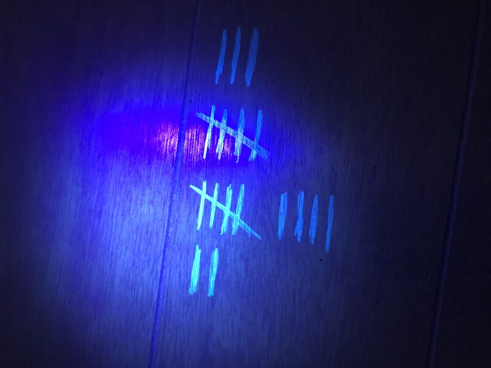
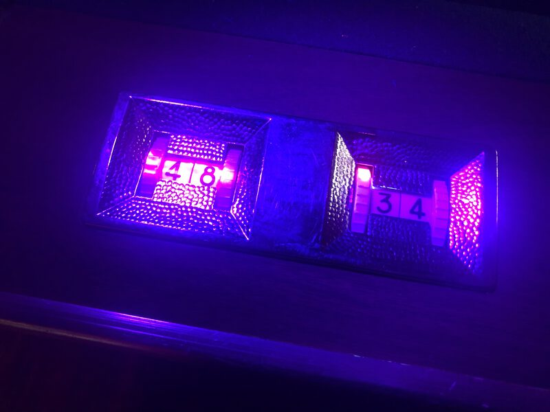
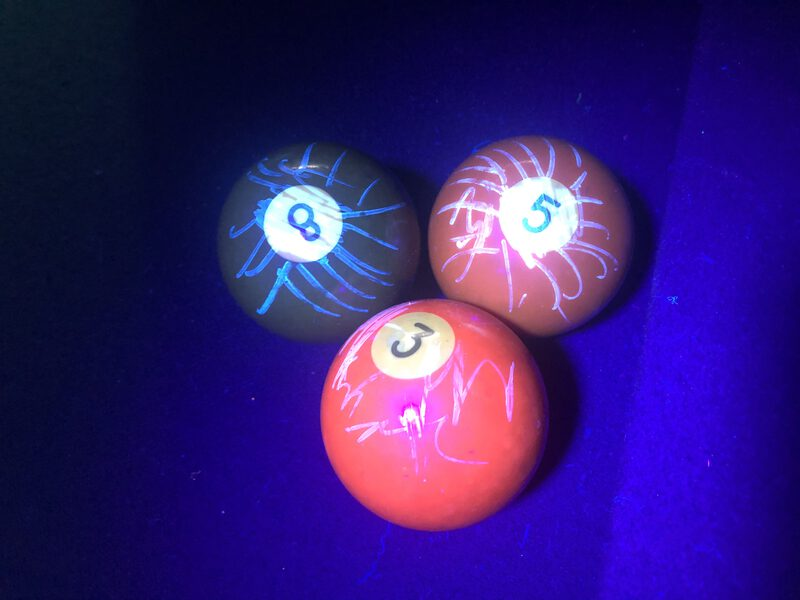
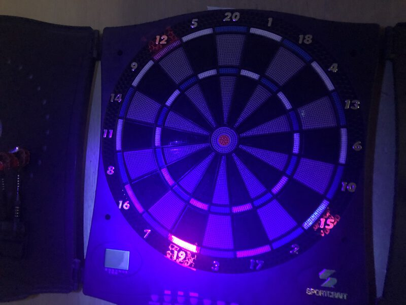

https://www.youtube.com/embed/je-6slUD054

This project contains the build instructions and necessary firmware to build 
an escape room using MakeCode and micro:bit. 
This room was originally build as a birthday activity; it worked great with kids and adults!

> **SPOILER ALERT** If you read those instructions, it will be much less fun to play the room.

## The skeleton story

The plot of the room is fairly basic and can be tweaked to fit your liking:

* play players have a fixed time  to find and disable the bomb (the **clock micro:bit** displays countdown)
* the bomb mechanism (the **bomb micro:bit**) is inside in a box
* the box is locked by a physical combination lock
* the key of the combination lock is registerd in 4 micro:bit (**lock micro:bit**)
* each key micro:bit can be unlocked via a unique code transmitted using radio
* a micro:bit device is available in the room to transmit codes (rotary phone or binary encoder **phone micro:bit**)
* codes are hidden in the room one way or the other
* a **game master micro:bit** allows the operator to monitor the status of the system
and control the clock.

Around those basic principles, you'll want to build a story that fits the theme of your party
or the room ambience. Feel free to remix and modify as you need it.






## Materials

The materials below are based on hiding code using UV markers and UV light.
It's a fun way to place secret numbers in a room.

* 7 micro:bits, battery packs and spare batteries
* a UV light marker
* 2 UV flashlight, the same flashlight used to spot dog pee spots
* a box and a 4-digit combination lock for that box
* (optional) Music speaker and smoke machine
* (optional) a old rotary phone
* (optional) a old typewriter

## Code setup

The first task is to find and hide 4 codes in the room. Using the UV markers,

* you can draw a code as sticks on the wall,
* you can paint the numbers of a computer keyboard,
* find more ways to encode codes in your room!

If you are using the A/B encoder, keep the number short (1000-1000 range) as they will have to be encoded in binary
over radio. Once you have picked 4 codes, marked them down on paper.

## Device setup

The room is composed of various micro:bit communicating. 
You will need to download the code in each micro:bit to get the room setup.

It's recommend to use double-sided tape to secure the battery pack to the back of the
micro:bit and use clear tap + sharpie to mark each micro:bit with their roles.

### Game Master

The [game master](https://github.com/pelikhan/pxt-escape-game-master)
controls the clock, reset the game and log all messages.

* **Update the game master source code with your codes!**
* Download the program
* Connect the micro:bit game master to the editor to 
see the messages in the console.

Pressing A removes a minute, B adds a minute, A+B resets the clock.

If the detonator is disabed,the clock will show a ``WIN`` message.
If the time runs off, it will display a ``LOSE`` message.

### Clock

The [escape clock](https://github.com/pelikhan/pxt-escape-clock)
displays the time.

* Download the program
* Check that the clock displays time

Try pressing A/B on the game master and check that the clock is updating.

### Lock

The [escape lock](https://github.com/pelikhan/pxt-escape-lock)
is a micro:bit that controls a combination for a lock.
It requires all locks to be enabled for them to show their digits.

* Change the digit for each micro:bit and download it.

Each lock is waiting for a code to be sent via radio.

### Phone

The [escape phone](https://github.com/pelikhan/pxt-escape-phone) 
is a rotary phone driver to send codes over radio. Players use
it to send codes to the locks.

* If you have a vintage rotary phone at hand, 
here is a [guide to convert it](https://youtu.be/je-6slUD054)
* Otherwise, numbers can be encoded as a binary sequence of A and B button presses (A = 0, B = 1)

### Detonator

The [escape detonator](https://github.com/pelikhan/pxt-escape-bomb),
is a hidden micro:bit that needs to be disabled by pressing a button

* Download the program to 1 micro:bit

## Room setup

Once all the micro:bit have been prepared, 
you're ready to put it all together and get the escaping to work.

## API Usage

If you plan to modify the code, here's a bit of docs.

### onEvent

Received when a particular event happened on a device in the game.

### onUpdate

Use this function register the code that renders the current 
state to the gizmo. If the game is lost or won, it will display
the correct animation.

```blocks
escape.onUpdate(function() {
})
```

## Use this extension

This repository can be added as an **extension** in MakeCode.

* open [https://makecode.microbit.org/](https://makecode.microbit.org/)
* click on **New Project**
* click on **Extensions** under the gearwheel menu
* search for the URL of this repository and import

## Edit this extension

To edit this repository in MakeCode.

* open [https://makecode.microbit.org/](https://makecode.microbit.org/)
* click on **Import** then click on **Import URL**
* paste the repository URL and click import

### Metadata (used for search, rendering)

* for PXT/microbit
<script src="https://makecode.com/gh-pages-embed.js"></script>
<script>
makeCodeRender("https://makecode.microbit.org/", "{{ site.github.owner_name}}/{{ site.github.repository_name }}");
</script>

